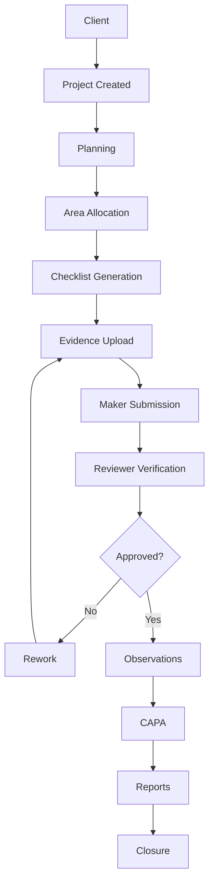
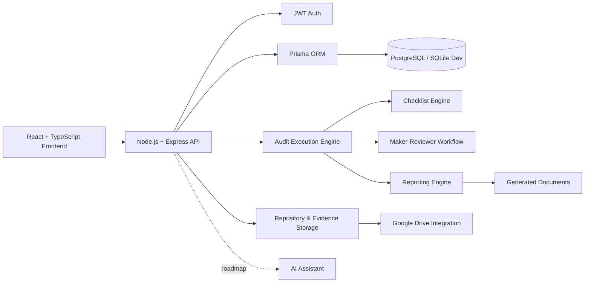

<div align="center">

  

  # Auditie

  ### Enterprise Audit & Compliance Management Platform

  **Replace Excel. Standardize audits. Accelerate compliance.**

  Auditie is a premium audit execution workspace for IT Audit and Compliance consultancies managing ISO 27001, SOC 2, ITGC, VAPT, PCI DSS, HIPAA, NIST, and client-specific engagements.

  <br />

  
  
  
  
  
  

  
  
  
  
  
  
  
  
  

  <br />

  [](#)
  [](#installation)
  [](https://github.com/sayma-shaikh/-Auditie---Audit-Compliance-Management-Platform/issues)
  [](https://github.com/sayma-shaikh/-Auditie---Audit-Compliance-Management-Platform)

</div>

---

<div align="center">

  

  <p><strong>Dashboard preview</strong> - centralized audit health, review queue, workload, milestones, and project activity.</p>

</div>

---

## Why Auditie?

Traditional IT audit teams still run serious compliance work through disconnected tools.

| The old way | The Auditie way |
| --- | --- |
| Excel files for checklists, samples, observations, and trackers | One structured audit execution workspace |
| Email threads for evidence and review comments | Evidence and review decisions linked to exact work items |
| Google Drive folders with unclear ownership | Project repository with traceable evidence linking |
| Word documents edited manually | Template-driven document and report generation |
| Manual reviewer follow-up | Maker-reviewer workflow with clear queues |
| Progress updated by guesswork | Progress driven by milestones, areas, and working papers |
| Scattered observations and CAPA | Connected observation and remediation registers |
| Weak audit trail | Logged activity across projects, evidence, reviews, and users |

> Auditie turns audit delivery into a controlled, reviewable, and repeatable operating system for consultancies.

---

## Feature Showcase

| 📊 Dashboard | 🧭 Milestone Tracker | 📋 Checklist Engine |
| --- | --- | --- |
| Real-time project health, team workload, deadlines, review queue, and recent activity. | Workflow-based audit milestones with owners, required actions, dates, progress, and workspace routes. | Question checklists and Excel-like table working papers for real audit execution. |

| 📁 Repository | 📎 Evidence | 🔍 Observations |
| --- | --- | --- |
| Central project repository with folders, upload, Google Drive integration, and evidence linking. | Attach evidence to checklist rows, audit areas, observations, milestones, and repository records. | Capture findings with severity, clause, owner, reviewer, evidence, and status. |

| ✅ CAPA | 📝 Reports | 🧩 Templates |
| --- | --- | --- |
| Track root cause, corrective action, preventive action, responsible user, due date, and closure. | Manage draft reports, final reports, submissions, review comments, and supporting files. | Generate policies, procedures, standards, registers, and audit documents from reusable templates. |

| 👥 Users | 🕒 Audit Logs | 🤖 AI Assistant |
| --- | --- | --- |
| Assign makers, reviewers, audit managers, tasks, and review queues with performance visibility. | Every meaningful action is logged for defensibility and traceability. | Planned copilot for audit guidance, evidence gap detection, observations, CAPA, and report drafting. |

---

## Product Modules

### 📊 Dashboard

High-level operational control for audit managers.

| Capability | Description |
| --- | --- |
| Audit health | See active, delayed, pending, and completed work |
| Team workload | Understand assignment distribution and bottlenecks |
| Review queue | Track pending maker-reviewer actions |
| Recent activity | See changes across projects, evidence, and users |


---

### 🗂️ Projects

Every client engagement becomes a structured project.

| Project Data | Managed In Auditie |
| --- | --- |
| Client profile | Company details, framework, industry, dates, and scope |
| Audit team | Audit Manager, makers, reviewers, and assigned users |
| Delivery state | Status, progress, areas, milestones, repository, and reports |


---

### 🧭 Milestones

Milestones are dynamic audit workspaces, not generic cards.

| Milestone | Workspace |
| --- | --- |
| Review Planning | Planning checklist and required documents |
| Kick-off Meeting | Meeting agenda, attendees, MoM, and action items |
| Data Requirement Roll Out | Request tracker |
| RCM | Risk and Control Matrix tracker |
| Sampling | Population and sample tracker |
| Review Execution | Area execution summary |
| Draft / Final Reports | Report versions, review, and submission tracking |


---

### 👤 Assignments

Assign audit areas to makers and reviewers with project-level oversight.

| Assignment Field | Purpose |
| --- | --- |
| Area | HR, Admin, Application, System Verification, AWS, Linux, Firewall, and more |
| Maker | Auditor responsible for execution |
| Reviewer | Reviewer or Audit Manager fallback |
| Due date | Planned completion date |
| Status | Not started, in progress, submitted, approved, rework |


---

### 📋 Checklist Engine

Auditie supports two execution modes.

| Mode | Best For | Experience |
| --- | --- | --- |
| Question View | Interviews, walkthroughs, physical verification, governance review | Question cards with response, remarks, observation, and evidence |
| Table View | HR testing, UAM, asset review, vendor review, backup review, change review | Spreadsheet-style rows, columns, filters, import, export, and row evidence |


---

### 📁 Repository & Evidence

The repository is the evidence backbone.

| Feature | Detail |
| --- | --- |
| Folder hierarchy | Project evidence organized like a professional audit file |
| Evidence linking | Link files to rows, areas, observations, milestones, and reports |
| Google Drive | Connect Drive as an evidence source |
| Uploads | Bring local evidence into the project repository |


---

### 🔍 Observations

Capture and track audit findings from execution to closure.

| Observation Field | Purpose |
| --- | --- |
| Title and description | Clear finding narrative |
| Severity | Risk-based prioritization |
| Clause / control | Framework traceability |
| Evidence | Proof supporting the finding |
| Owner and reviewer | Accountability |
| Status | Lifecycle tracking |


---

### ✅ CAPA

Move findings into remediation governance.

| CAPA Element | Tracked |
| --- | --- |
| Root cause | Why the issue occurred |
| Corrective action | Immediate fix |
| Preventive action | Future prevention |
| Responsible person | Owner accountability |
| Verification | Closure validation |


---

### 📝 Reports

Manage report lifecycle from draft to final submission.

| Report Workflow | Description |
| --- | --- |
| Draft preparation | Upload and track report versions |
| Review | Capture review comments and status |
| Final report | Manage final version and approval |
| Submission | Track submitted-to, date, mode, and acknowledgement |


---

### 🧩 Templates

Automate reusable audit and compliance documents.

| Template Type | Examples |
| --- | --- |
| Policies | ISMS, HR, access control, information security |
| Procedures | Backup, incident, change, user access |
| Registers | Risk, asset, vendor, incident, CAPA |
| Reports | Audit report, executive summary, observation report |


---

### 👥 Users

Track work allocation and team performance.

| Metric | Value |
| --- | --- |
| Assigned tasks | Visibility over workload |
| Completed work | Delivery tracking |
| Pending reviews | Reviewer queue |
| Overdue work | Management action |
| Average completion time | Performance insight |


---

### 🕒 Audit Logs

Every important action is recorded.

| Logged Activity | Example |
| --- | --- |
| Evidence | File uploaded or linked |
| Checklist | Response updated or submitted |
| Review | Approved, rejected, or rework requested |
| Project | Status, milestone, or assignment changed |
| User | Login and key user activity |


---

### 🤖 AI Assistant

Planned AI capabilities for audit acceleration.

| Planned Capability | Use Case |
| --- | --- |
| Audit guidance | ISO and control interpretation |
| Evidence gap detection | Identify missing proof |
| Observation drafting | Convert issues into professional findings |
| CAPA suggestions | Recommend remediation actions |
| Report drafting | Assist with audit report language |


---

## Audit Lifecycle



---

## Platform Architecture



---

## Screenshot Gallery

| Module | Preview |
| --- | --- |
| Dashboard |  |
| Projects |  |
| Checklist |  |
| Question View |  |
| Repository |  |
| Timeline |  |
| Reports |  |
| Observations |  |
| CAPA |  |
| Users |  |
| Templates |  |

---

## Auditie vs Excel

| Feature | Excel | Auditie |
| --- | --- | --- |
| Evidence tracking | Manual links and folders | Evidence attached to exact work items |
| Version control | Duplicated files | Central records and repository |
| Reviewer workflow | Email follow-up | Maker-reviewer queues and statuses |
| Observations | Separate tracker | Integrated observation register |
| CAPA | Separate tracker | Connected remediation workflow |
| Repository | Google Drive folders | Project evidence workspace |
| Reports | Manual Word edits | Report lifecycle and template engine |
| Timeline | Static tracker | Dynamic milestone workspaces |
| Audit trail | Limited | Activity logs across the platform |
| Progress tracking | Manual percentages | Derived from work status |
| Role management | Informal | Admin, Audit Manager, Maker, Reviewer |
| Template generation | Copy-paste | Reusable document automation |
| Multi-framework support | Rebuilt per project | Framework-aware project execution |

---

## Framework Support

| Framework | Status | Use Case |
| --- | --- | --- |
| ISO 27001 | Supported | ISMS audits and implementation reviews |
| ISO 27701 | Supported | Privacy information management reviews |
| SOC 2 | Supported | Trust services audits and readiness |
| ITGC | Supported | General IT controls testing |
| VAPT | Supported | Vulnerability assessment and penetration testing workflow |
| PCI DSS | Supported | Payment card compliance reviews |
| NIST | Supported | Cybersecurity framework assessments |
| HIPAA | Supported | Healthcare compliance reviews |
| Internal Audit | Supported | Client-specific internal audits |
| Custom Frameworks | Flexible | Consultancy-specific methodology |

---

## Technology Stack

### Frontend


### Backend


### Database, Auth & Storage


---

## Folder Structure

```text
Auditie/
├─ src/
│  ├─ app/                       # App shell, auth, layout, routes
│  └─ features/
│     ├─ projects/               # Projects, areas, milestones, workspaces
│     └─ templates/              # Template automation UI
├─ server/
│  ├─ api/                       # Express route modules
│  ├─ data/                      # Checklist and review program libraries
│  ├─ integrations/              # Google Drive integration
│  ├─ middleware/                # Auth middleware
│  └─ services/                  # Workflow, milestone, performance services
├─ prisma/
│  ├─ migrations/                # Database migrations
│  ├─ schema.prisma              # Prisma schema
│  └─ seed.ts                    # Seed script
├─ scripts/                      # Maintenance and smoke-test scripts
├─ types/                        # Local TypeScript declarations
├─ server.ts                     # Express/Vite entrypoint
└─ README.md
```

---

## Installation

### 1. Clone

```bash
git clone https://github.com/sayma-shaikh/-Auditie---Audit-Compliance-Management-Platform.git
cd "-Auditie---Audit-Compliance-Management-Platform"
```

### 2. Install

```bash
npm install
```

### 3. Configure

Create `.env`:

```env
DATABASE_URL="file:./dev.db"
JWT_SECRET="change-this-secret"
NODE_ENV="development"
```

Google Drive integration requires OAuth credentials when enabled.

### 4. Prepare Database

```bash
npx prisma generate
npx prisma migrate deploy
```

### 5. Run

```bash
npm run dev
```

```text
http://localhost:3000
```

### 6. Build

```bash
npm run build
```

> Windows note: if your project path contains `&`, some npm command shims may fail. Use direct Node commands such as `node ./node_modules/typescript/bin/tsc --noEmit` when needed.

---

## Roadmap

### Completed

- [x] Project management
- [x] Audit area allocation
- [x] Question checklist workflow
- [x] Table checklist working papers
- [x] Evidence repository
- [x] Google Drive integration foundation
- [x] Maker-reviewer workflow
- [x] Observations and CAPA foundations
- [x] Workflow milestone tracker
- [x] Template automation foundation
- [x] Audit logs

### In Progress

- [ ] Enhanced milestone workspace UX
- [ ] Real screenshot gallery
- [ ] Reviewer queue polish
- [ ] Advanced notification workflows
- [ ] Production PostgreSQL deployment profile

### Planned

- [ ] AI Copilot
- [ ] Client Portal
- [ ] Azure AD / SSO
- [ ] Slack integration
- [ ] Microsoft Teams integration
- [ ] Power BI dashboards
- [ ] Risk Management
- [ ] Continuous Compliance Monitoring
- [ ] Vendor Portal
- [ ] Multi-tenant Consultancy Mode
- [ ] Jira integration
- [ ] Advanced repository permissions

---

## Advanced Details

<details>
<summary><strong>Supported audit lifecycle milestones</strong></summary>

- Review Planning
- Overall Project Management
- Team Briefing Meeting
- Review Kick Off Meeting
- Area-wise Review Checklist
- Data Requirement Roll Out
- Process Walkthrough
- Review Risk & Control Matrix
- Data Analytics - Sampling
- Review Execution
- Weekly Status Update
- Interim Review
- Queries Discussion
- Draft Report Preparation
- Draft Report Review
- Draft Report Submission
- Draft Report Discussion
- Final Report Preparation
- Final Report Review
- Final Report Submission
- Review Closing Meeting
- Review Committee Meeting

</details>

<details>
<summary><strong>Current development note</strong></summary>

Auditie is under active development. Some capabilities, especially AI, advanced notifications, SSO, client portal, and external dashboard integrations, are roadmap items. The current codebase includes the core project, milestone, checklist, evidence, repository, review, observation, CAPA, report, template, user, and audit log foundations.

</details>

<details>
<summary><strong>Runtime folders ignored by Git</strong></summary>

Runtime folders and sensitive files such as `uploads/`, `generated/`, `repository/`, `dist/`, local databases, logs, cookies, `.env`, and OAuth credentials are intentionally ignored.

</details>

---

## Contributing

Contributions are welcome.

| Step | Action |
| --- | --- |
| 1 | Fork the repository |
| 2 | Create a feature branch |
| 3 | Keep changes scoped and tested |
| 4 | Run TypeScript and build checks |
| 5 | Open a pull request with a clear summary |

Recommended checks:

```bash
node ./node_modules/typescript/bin/tsc --noEmit
npm run build
```

---

## License

Auditie is released under the **MIT License**.

---

<div align="center">

  <h3>Auditie</h3>

  <p><strong>Made with love for IT Auditors & Compliance Consultants.</strong></p>

  <p>
    <a href="#auditie">Back to top</a>
    ·
    <a href="https://github.com/sayma-shaikh/-Auditie---Audit-Compliance-Management-Platform/issues">Report Issue</a>
    ·
    <a href="https://github.com/sayma-shaikh/-Auditie---Audit-Compliance-Management-Platform">Star Repository</a>
  </p>

</div>
